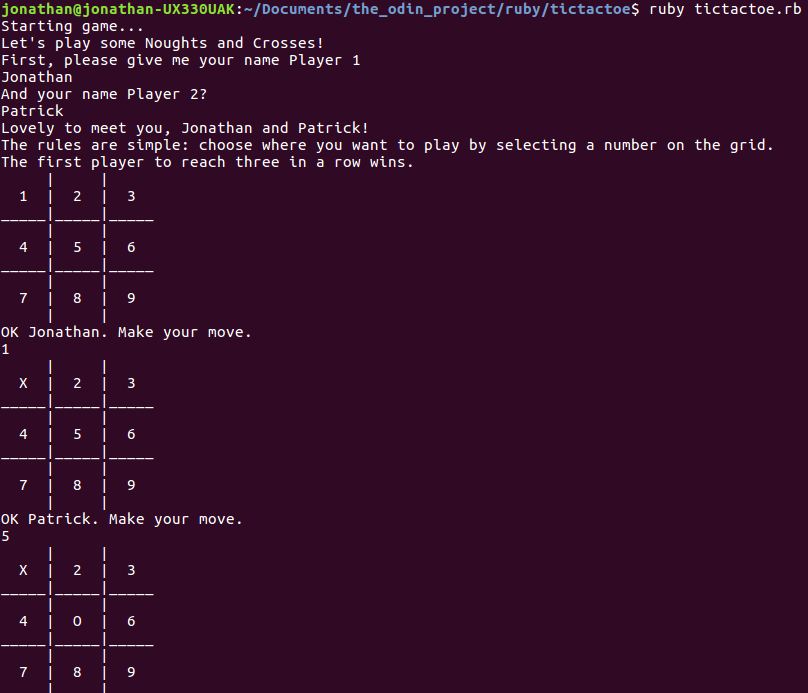

# Tic Tac Toe Game
This is a game of Noughts and Crosses (Tic-Tac-Toe to Americans) playable in the command line.  



It's a project from [The Odin Project](https://www.theodinproject.com/courses/ruby-programming/lessons/oop).


## Installation

Open your terminal/command line. Navigate to the directory where you want this project to live. Type:
```
$ git clone https://github.com/Jonosenior/tictactoe.git
$ cd tictactoe
$ ruby tictactoe.rb
```

## Pre-project thoughts

I'm excited to write my first working game in Ruby. I hope to better understand why object oriented (as opposed to procedural) programming is a useful way to organise code.

## Post-project thoughts

I found the differe

## Features to add
  1. AI so that you can play against the computer.
